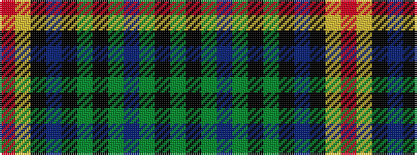

GKGBGKGKBKYR

It is a 12 stripe tartan.

<figure class="pat-woven">

<figcaption>idealised sample</figcaption>
</figure>

## Colour Sequence



## Tartans with this colour sequence

| Tartans |
|---------------|
| [Old Dobbs County (District)](/setts/s12/g10k1g10db1g1k1g1k1db10k1lo1r1~x4/)|
||
