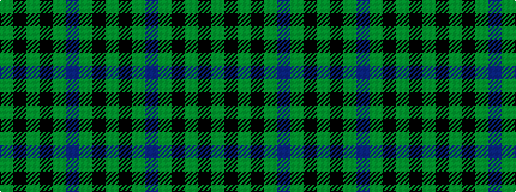

GKGBGKGKG

It is a 9 stripe tartan.

<figure class="pat-woven">

<figcaption>idealised sample</figcaption>
</figure>

## Colour Sequence



## Tartans with this colour sequence

| Tartans |
|---------------|
| [Herron from Ulster (Personal)](/variants/s9/dg12k11dg1k1dg1db10dg1k1dg1~x4/)|
||
