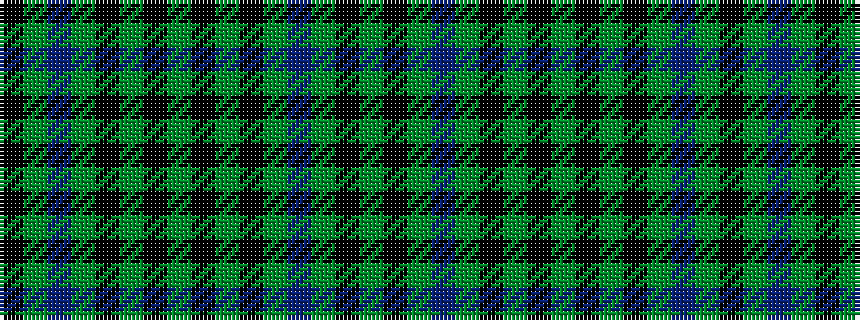

GKGBGKGKGKGKGBGK

It is a 16 stripe tartan.

<figure class="pat-woven">

<figcaption>idealised sample</figcaption>
</figure>

## Colour Sequence



## Tartans with this colour sequence

| Tartans |
|---------------|
| [Herron of Ulster (Personal)](/setts/s16/k1dg1db10dg1k1dg1k11dg12k11dg1k1dg1db10dg1k1dg1~x4/)|
||
