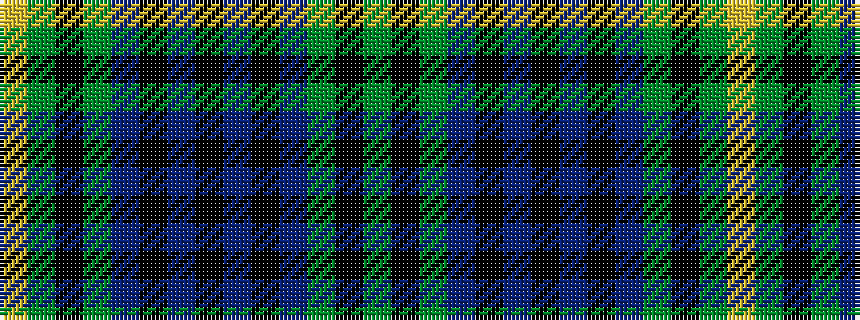

GKGBKBKBKBGKGY

It is a 14 stripe tartan.

<figure class="pat-woven">

<figcaption>idealised sample</figcaption>
</figure>

## Colour Sequence



## Tartans with this colour sequence

| Tartans |
|---------------|
| [Johnston/Johnstone](/variants/s14/ly3g2k1g30b24k2b2k2~x2/)|
||
