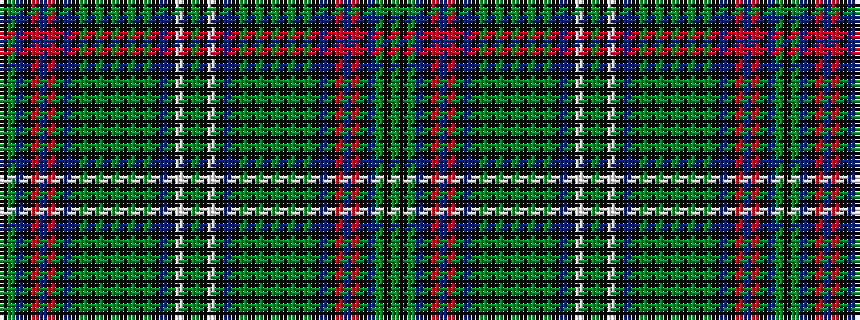

GKGBKRBRKBKGKGKGKGKGKBKWKGKWKBKGKGKGKGKGKBKRBRKBGK

It is a 50 stripe tartan.

<figure class="pat-woven">

<figcaption>idealised sample</figcaption>
</figure>

## Colour Sequence



## Tartans with this colour sequence

| Tartans |
|---------------|
| [Killen](/setts/s50/g8k1w2k1dt8k8g1k1g1k1g8k1g1k1g1k8dt8k1r2dt1r2k1dt8g8k1g5~x2/)|
||
