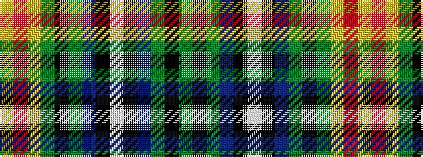

GKGBKWKBGKGYRY

It is a 14 stripe tartan.

<figure class="pat-woven">

<figcaption>idealised sample</figcaption>
</figure>

## Colour Sequence



## Tartans with this colour sequence

| Tartans |
|---------------|
| [Iowa American District Tartan](/variants/s14/g12k16dy5db20k4w2k4db20dy5k16g12ly3r4ly3~x2/)|
||
