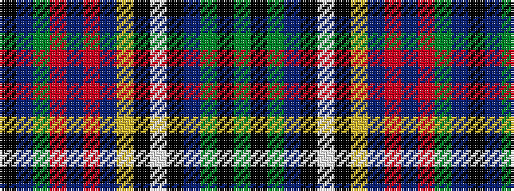

GKGBKWKYBRBRGBK

It is a 15 stripe tartan.

<figure class="pat-woven">

<figcaption>idealised sample</figcaption>
</figure>

## Colour Sequence



## Tartans with this colour sequence

| Tartans |
|---------------|
| [Astrobiology](/variants/s15/k23db1g1r3db2r1db12ly1k1w1k6db4g2k2g3~x2/)|
||
