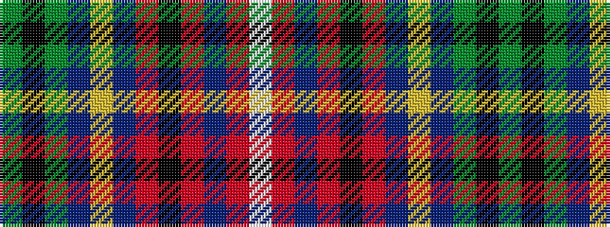

GKGBYBRKRBRW

It is a 12 stripe tartan.

<figure class="pat-woven">

<figcaption>idealised sample</figcaption>
</figure>

## Colour Sequence



## Tartans with this colour sequence

| Tartans |
|---------------|
| [British Columbia](/variants/s12/g2k1g4t4ly1t4r4k1r4t2r4w1~x4/)|
||
