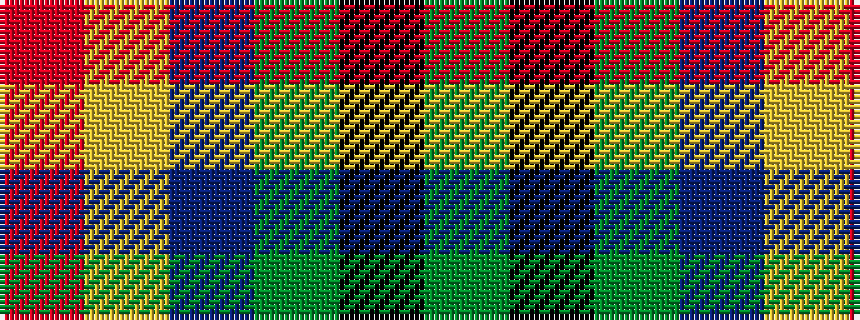

GKGBYR

It is a 6 stripe tartan.

<figure class="pat-woven">

<figcaption>idealised sample</figcaption>
</figure>

## Colour Sequence



## Tartans with this colour sequence

| Tartans |
|---------------|
| [Thompson (J.C.'s Fancy) (Personal)](/variants/s6/r2lo8db2y4k4y1~x6/)|
||
