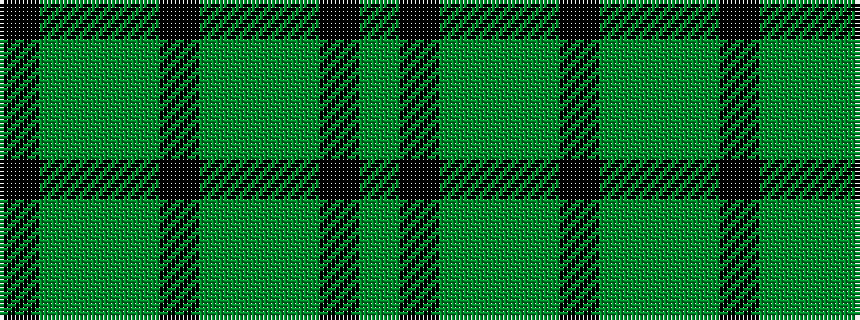

GKGGGKGGGK

It is a 10 stripe tartan.

<figure class="pat-woven">

<figcaption>idealised sample</figcaption>
</figure>

## Colour Sequence



## Tartans with this colour sequence

| Tartans |
|---------------|
| [Campbell-Simpson (Personal)](/variants/s10/g12k2g2dg9g4k2~x4/)|
||
