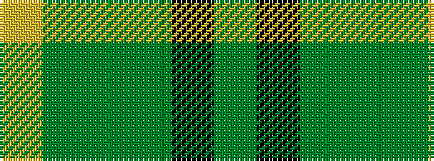

GKGGGY

It is a 6 stripe tartan.

<figure class="pat-woven">

<figcaption>idealised sample</figcaption>
</figure>

## Colour Sequence



## Tartans with this colour sequence

| Tartans |
|---------------|
| [Gordon Cumming (Artefact)](/variants/s6/ly10g30gi25g30k2g3~x2/)|
||
