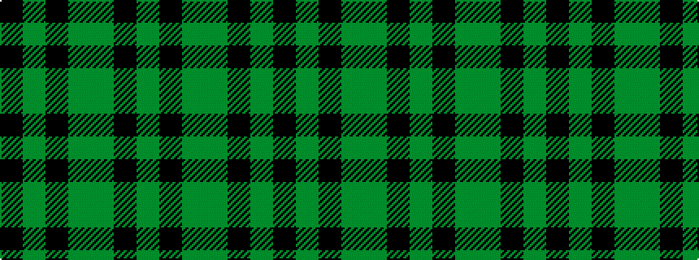

GKGGKGK

It is a 7 stripe tartan.

<figure class="pat-woven">

<figcaption>idealised sample</figcaption>
</figure>

## Colour Sequence



## Tartans with this colour sequence

| Tartans |
|---------------|
| [Granite City (Silver Granite) Fashion Tartan](/variants/s7/k3y3k3y21dy21k3y1~x2/)|
||
