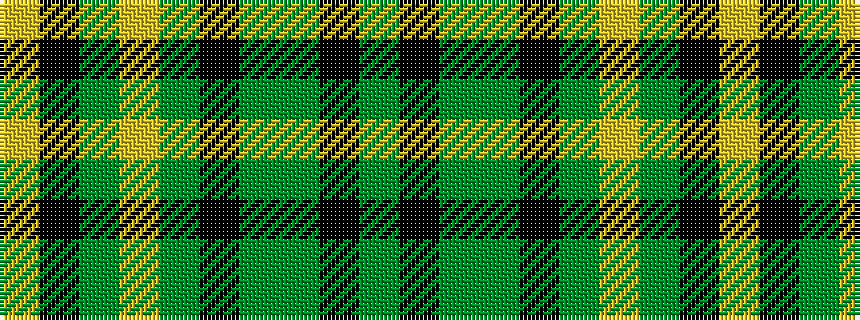

GKGGKGYGKY

It is a 10 stripe tartan.

<figure class="pat-woven">

<figcaption>idealised sample</figcaption>
</figure>

## Colour Sequence



## Tartans with this colour sequence

| Tartans |
|---------------|
| [Pride of Ireland Fashion Tartan Tartan Number: 5157. Earliest known date: 2008 ONLY FOR DISPLAY PURPOSES. Count and sample from Lochcarron Feb. 2008. See products available Copyright © Blair Urquhart, Comrie, 2015](/setts/s10/dg9k2dg2g13k2g2ly1dg13k26ly2~x2/)|
||
