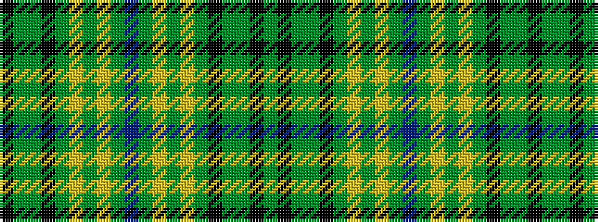

GKGGKGYGYGBGYGYGKGGK

It is a 20 stripe tartan.

<figure class="pat-woven">

<figcaption>idealised sample</figcaption>
</figure>

## Colour Sequence



## Tartans with this colour sequence

| Tartans |
|---------------|
| [Wagga Wagga](/variants/s20/gi16k6gi16g32k2dy7ly2dy7ly2dy7b13/)|
||
