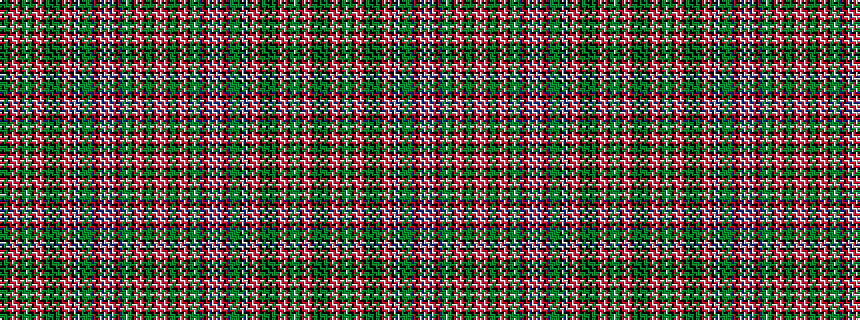

GKGGKRWRWRKGGWGGKRWRWRKGGKGKGGKRWRWRKWBWKGGGGGBRKRWBWRWBWRKRBGGWGGKRWRWRKGGGKRWRW

It is a 81 stripe tartan.

<figure class="pat-woven">

<figcaption>idealised sample</figcaption>
</figure>

## Colour Sequence



## Tartans with this colour sequence

This pattern is a design lineage: every tartan below shares one colour order, whatever its owner —
near-identical designs are grouped, the largest lineage first (#112: the pattern is a tartan's
second parent, beside its family or clan).

<table class="sett-table">
<tbody>
<tr><td><a href="/variants/s81/g14k4g14y4k2r8w2r8w2r8k2y2g8w2g8y2k2r8w2r8w2r8k2y2g14k4g14k4g14y2k2r8w2r8w2r8k12w1db4w1k12y4g6y2g6y4dp2r4k2r14w1db2w1r14w1db2w1r14k2r4dp2y2g8w2g8y2k2r8w2r8w2r8k2y4g8y4k2r8w2r8w2~x2/">Ogilvie - 1831 (Clan)</a></td></tr>
<tr><td class="sett-swatch"></td></tr>
</tbody>
</table>

