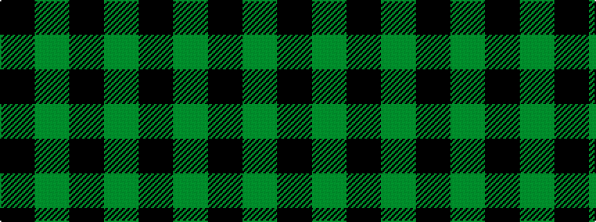

GKGK

It is a 4 stripe tartan.

<figure class="pat-woven">

<figcaption>idealised sample</figcaption>
</figure>

## Colour Sequence



## Tartans with this colour sequence

This pattern is a design lineage: every tartan below shares one colour order, whatever its owner —
near-identical designs are grouped, the largest lineage first (#112: the pattern is a tartan's
second parent, beside its family or clan).

<table class="sett-table">
<tbody>
<tr><td><a href="/variants/s3/k5y1k1~x12/">Justus</a></td></tr>
<tr><td class="sett-swatch"></td></tr>
<tr><td><a href="/variants/s4/k3g15k20y3~x2/">Scotch Tape 2 (Corporate)</a></td></tr>
<tr><td class="sett-swatch"></td></tr>
<tr><td><a href="/variants/s4/k1g8k8y1/">Wallace Hunting</a></td></tr>
<tr><td class="sett-swatch"></td></tr>
<tr><td><a href="/variants/s4/k4g33k33y4~x2/">Wallace, hunting</a></td></tr>
<tr><td class="sett-swatch"></td></tr>
<tr class="cluster-sep"><td></td></tr>
<tr><td><a href="/variants/s4/g22k3g25k4~x2/">Campbell Simpson</a></td></tr>
<tr><td class="sett-swatch"></td></tr>
<tr><td><a href="/variants/s3/g12k4g1~x2/">Graham</a></td></tr>
<tr><td class="sett-swatch"></td></tr>
<tr class="cluster-sep"><td></td></tr>
<tr><td><a href="/variants/s4/k34y3k34y26~x2/">Raeburn</a></td></tr>
<tr><td class="sett-swatch"></td></tr>
<tr><td><a href="/variants/s4/k6y1k6y6~x6/">Raeburn</a></td></tr>
<tr><td class="sett-swatch"></td></tr>
</tbody>
</table>

