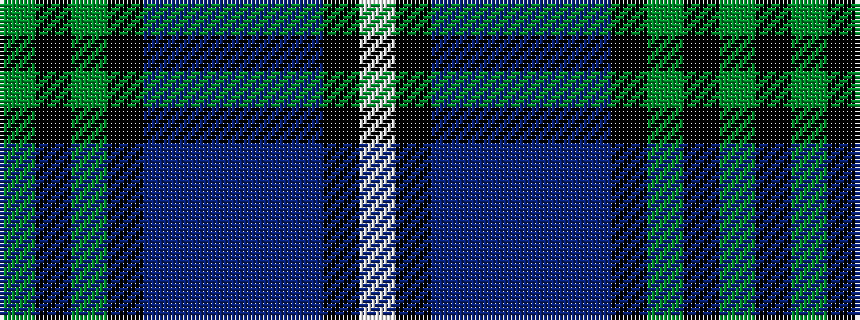

GKGKBBBBBKW

It is a 11 stripe tartan.

<figure class="pat-woven">

<figcaption>idealised sample</figcaption>
</figure>

## Colour Sequence



## Tartans with this colour sequence

| Tartans |
|---------------|
| [Scottish Rugby Union (City of Nagasaki)](/variants/s11/g6k2g24k10dt2p2dt2p2dt10k2lb3~x2/)|
||
