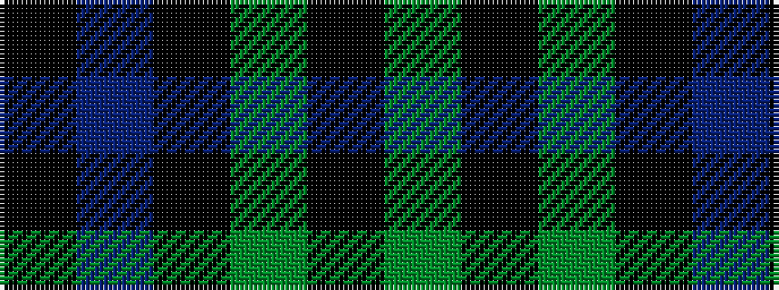

GKGKBK

It is a 6 stripe tartan.

<figure class="pat-woven">

<figcaption>idealised sample</figcaption>
</figure>

## Colour Sequence



## Tartans with this colour sequence

| Tartans |
|---------------|
| [Duchess of Fife](/setts/s6/g70k26g12k14b3k16~x2/)|
||
| [Duchess of Fife #2](/setts/s6/g70k26g12k14db3k16~x2/)|
||
| [Fife, Duchess of..](/setts/s6/g30k12g6k6db2k5~x2/)|
||
