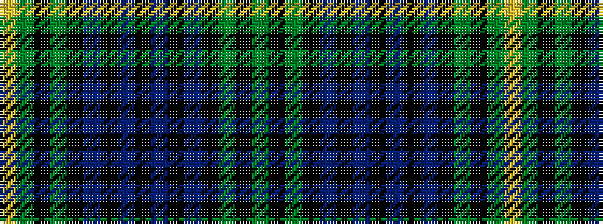

GKGKBKBKBKBKGKGY

It is a 16 stripe tartan.

<figure class="pat-woven">

<figcaption>idealised sample</figcaption>
</figure>

## Colour Sequence



## Tartans with this colour sequence

| Tartans |
|---------------|
| [Grand Lodge of Scotland](/variants/s16/g18k6g1k1db1k6db1k2db1k6db1k1g1k6g21ly1~x2/)|
||
| [Grand Lodge of Scotland Corporate Weavers Tartan](/variants/s16/dg18k6dg1k1db1k6db1k2db1k6db1k1dg1k6dg21ly1~x2/)|
||
