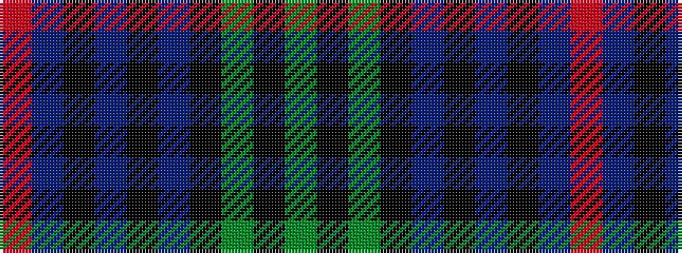

GKGKBKBKBR

It is a 10 stripe tartan.

<figure class="pat-woven">

<figcaption>idealised sample</figcaption>
</figure>

## Colour Sequence



## Tartans with this colour sequence

| Tartans |
|---------------|
| [Armstrong](/setts/s10/r3db12k1db1k1db2k12g30k1g2~x2/)|
||
| [Armstrong](/setts/s10/r3db12k1db1k1db2k12dg30k1dg2~x2/)|
||
