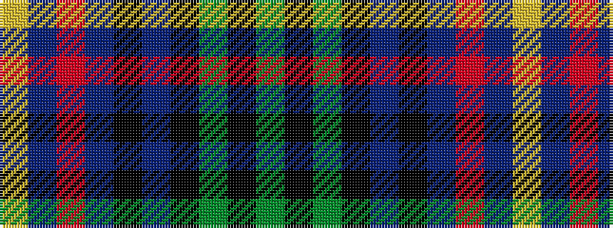

GKGKBKBRBY

It is a 10 stripe tartan.

<figure class="pat-woven">

<figcaption>idealised sample</figcaption>
</figure>

## Colour Sequence



## Tartans with this colour sequence

| Tartans |
|---------------|
| [Borders Health Board (Corporate)](/setts/s10/g6k3g6k3b3k3b25r3b3ly3~x2/)|
||
