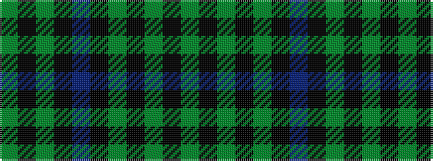

GKGKBKGKGKG

It is a 11 stripe tartan.

<figure class="pat-woven">

<figcaption>idealised sample</figcaption>
</figure>

## Colour Sequence



## Tartans with this colour sequence

| Tartans |
|---------------|
| [Pike (Personal)](/setts/s11/g10k3g3k20dp3k5g3k20g3k3g10~x2/)|
||
