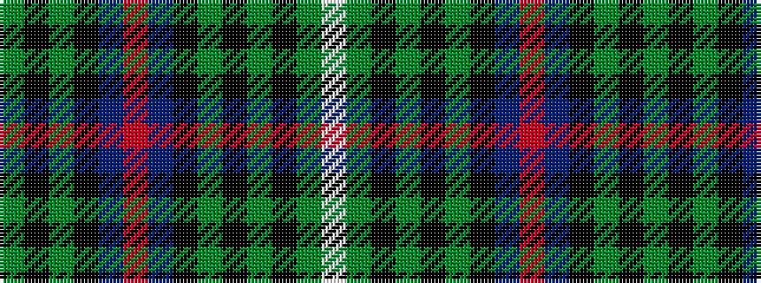

GKGKBRBKGKGKGW

It is a 14 stripe tartan.

<figure class="pat-woven">

<figcaption>idealised sample</figcaption>
</figure>

## Colour Sequence



## Tartans with this colour sequence

| Tartans |
|---------------|
| [Urquhart](/setts/s14/g1k1g8k8db8r1db8k8g1k1g1k1g3w1~x2/)|
||
| [Urquhart (Brydone)](/setts/s14/dg1k1dg8k8db8r1db8k8dg1k1dg1k1dg3w1~x2/)|
||
