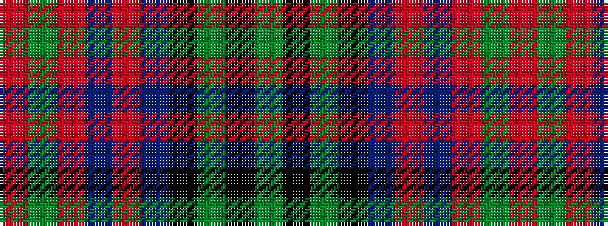

GKGKBRBRGR

It is a 10 stripe tartan.

<figure class="pat-woven">

<figcaption>idealised sample</figcaption>
</figure>

## Colour Sequence



## Tartans with this colour sequence

| Tartans |
|---------------|
| [Law Society of Scotland (Corporate)](/setts/s10/r6g3r24t7r4t7k18g4k7g3/)|
||
