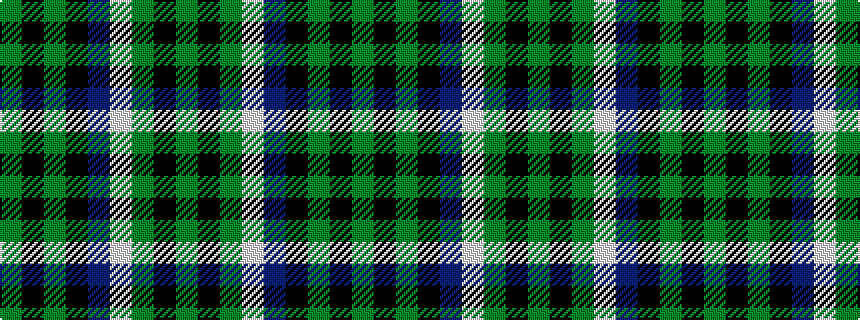

GKGKBWGKG

It is a 9 stripe tartan.

<figure class="pat-woven">

<figcaption>idealised sample</figcaption>
</figure>

## Colour Sequence



## Tartans with this colour sequence

| Tartans |
|---------------|
| [Black Gold](/variants/s9/dy3k3dy3k18n28w1g22k2dy2~x2/)|
||
| [Black Gold (Corporate)](/variants/s9/dy3k3dy3k18n28lb1dg22k2dy2~x2/)|
||
