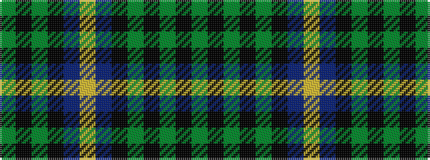

GKGKBYBKGKGKG

It is a 13 stripe tartan.

<figure class="pat-woven">

<figcaption>idealised sample</figcaption>
</figure>

## Colour Sequence



## Tartans with this colour sequence

| Tartans |
|---------------|
| [Dewar's Highlander](/variants/s13/g56k6g7k6g7k35db45lo6db45k35g45k6g6/)|
||
| [Dewar, Highlander](/variants/s13/dg46k5dg6k5dg6k30db38ly6db38k30dg36k6dg6/)|
||
