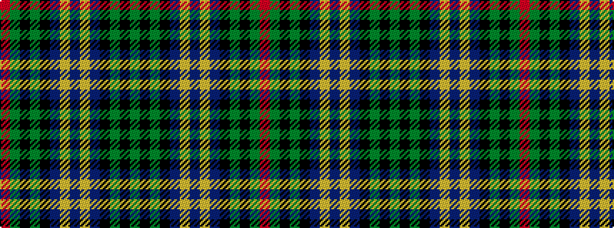

GKGKBYBYBKGKGR

It is a 14 stripe tartan.

<figure class="pat-woven">

<figcaption>idealised sample</figcaption>
</figure>

## Colour Sequence



## Tartans with this colour sequence

| Tartans |
|---------------|
| [Ogilvie Hunting](/variants/s14/t30ly3t4k25y26k3y3r4~x2/)|
||
