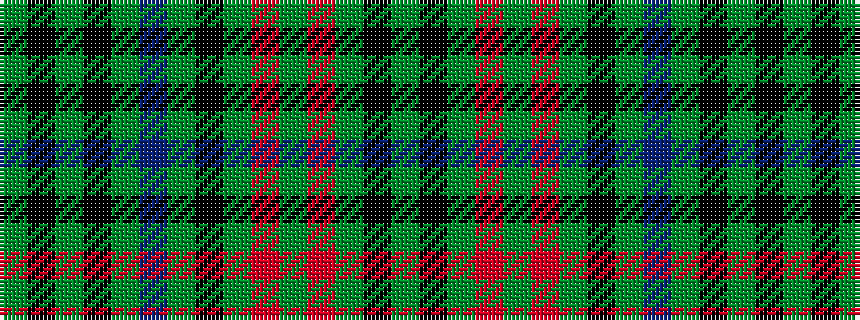

GKGKGBGKGRGRGKG

It is a 15 stripe tartan.

<figure class="pat-woven">

<figcaption>idealised sample</figcaption>
</figure>

## Colour Sequence



## Tartans with this colour sequence

| Tartans |
|---------------|
| [Hickey (Name)](/setts/s15/g3k1g1r12g1r1g1k4g1t2g15k1g1k1g3~x4/)|
||
