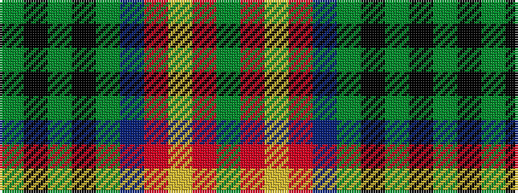

GKGKGBRYRG

It is a 10 stripe tartan.

<figure class="pat-woven">

<figcaption>idealised sample</figcaption>
</figure>

## Colour Sequence



## Tartans with this colour sequence

| Tartans |
|---------------|
| [Connolly Dress (Name)](/setts/s10/g6k2g3k2g6db8r20ly2r3g2~x2/)|
||
