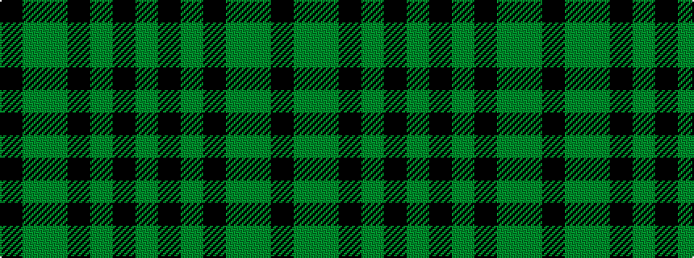

GKGKGGK

It is a 7 stripe tartan.

<figure class="pat-woven">

<figcaption>idealised sample</figcaption>
</figure>

## Colour Sequence



## Tartans with this colour sequence

| Tartans |
|---------------|
| [McCanna NW (Olympia, USA) Hunting (Personal)](/variants/s7/k1dy4g1k1g1k1dy1~x14/)|
||
| [McCanna NW Htg (Personal)](/variants/s7/k1dy4dg1k1dg1k1dy1~x10/)|
||
