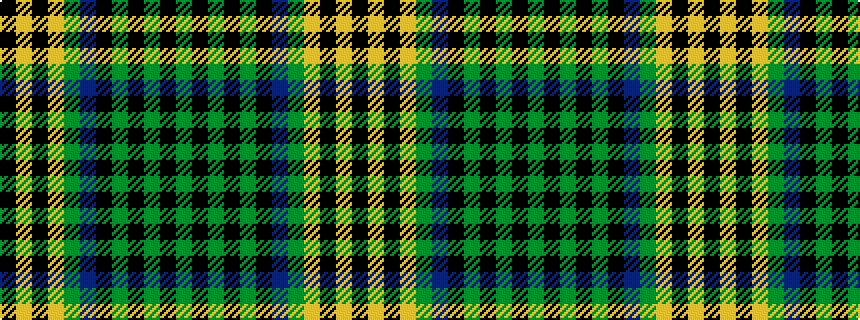

GKGKGKBGYKYK

It is a 12 stripe tartan.

<figure class="pat-woven">

<figcaption>idealised sample</figcaption>
</figure>

## Colour Sequence



## Tartans with this colour sequence

| Tartans |
|---------------|
| [MacMillan - 1847 (Clan)](/setts/s12/g7k3g53k3g8k3dr24g8lo18k3lo18k3~x2/)|
||
| [MacMillan Ancient](/tartans/dg2k1dg18k1dg2k1dr12dg4ly6k1ly6k1/)|
||
