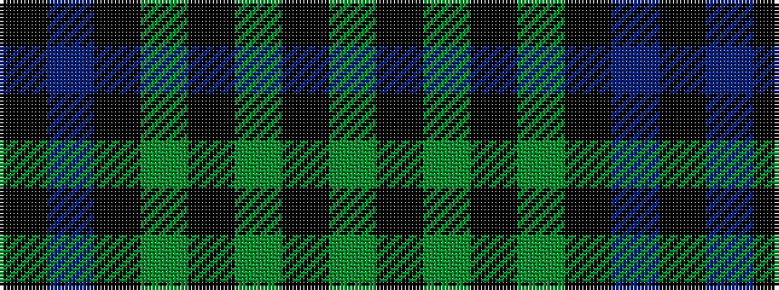

GKGKGKBK

It is a 8 stripe tartan.

<figure class="pat-woven">

<figcaption>idealised sample</figcaption>
</figure>

## Colour Sequence



## Tartans with this colour sequence

| Tartans |
|---------------|
| [Keith McCormick (Personal)](/setts/s8/k1db5k4g3k1g3k6g1~x4/)|
||
