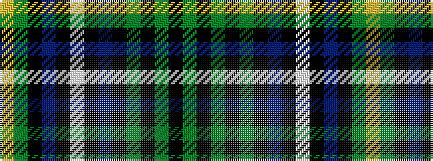

GKGKGKBKWKBKGY

It is a 14 stripe tartan.

<figure class="pat-woven">

<figcaption>idealised sample</figcaption>
</figure>

## Colour Sequence



## Tartans with this colour sequence

| Tartans |
|---------------|
| [Proctor](/variants/s14/g78k4g4k4g4k6db26k4w8k4db26k6g48ly3/)|
||
| [Proctor (Name)](/variants/s14/dg39k2dg2k2dg2k3dt13k2lb4k2dt13k3dg24lo3~x2/)|
||
