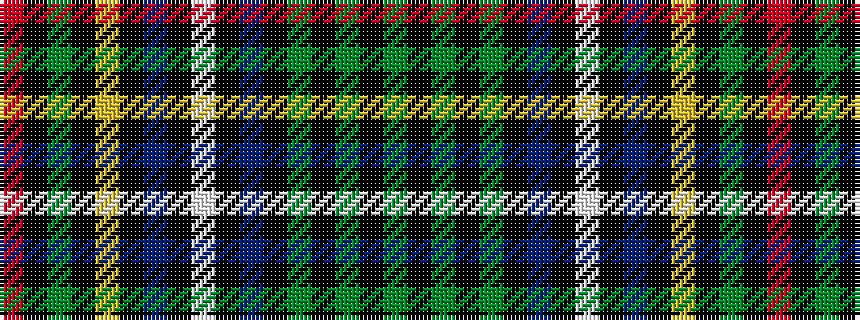

GKGKGKBKWKBKYKGKR

It is a 17 stripe tartan.

<figure class="pat-woven">

<figcaption>idealised sample</figcaption>
</figure>

## Colour Sequence



## Tartans with this colour sequence

| Tartans |
|---------------|
| [Cockburn](/variants/s17/dg36k1dg1k1dg1k1db12k1lb1k1db12k1ly1k1dg12k2r2/)|
||
| [Cockburn](/variants/s17/g36k1g1k1g1k1db12k1w1k1db12k1ly1k1g12k2r2~x2/)|
||
