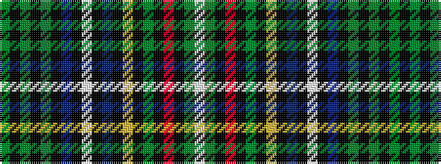

GKGKGKBKWKBKYKGKRKGW

It is a 20 stripe tartan.

<figure class="pat-woven">

<figcaption>idealised sample</figcaption>
</figure>

## Colour Sequence



## Tartans with this colour sequence

| Tartans |
|---------------|
| [Unidentified #30](/variants/s20/dg82k2dg2k2dg2k8db28k1w6k1db28k1ly6k1dg32k2r5k2dg15w6~x2/)|
||
| [Unnamed 8](/variants/s20/g82k2g2k2g2k8db28k1w6k1db28k1ly6k1g32k2r5k2g15w6~x2/)|
||
