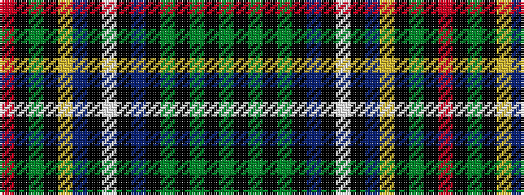

GKGKGKBKWKBYKGKR

It is a 16 stripe tartan.

<figure class="pat-woven">

<figcaption>idealised sample</figcaption>
</figure>

## Colour Sequence



## Tartans with this colour sequence

| Tartans |
|---------------|
| [Cockburn - 1830 (Clan)](/variants/s16/g10k1g1k1g1k1db4k1w1k1db1ly1k1g4k1r1~x4/)|
||
