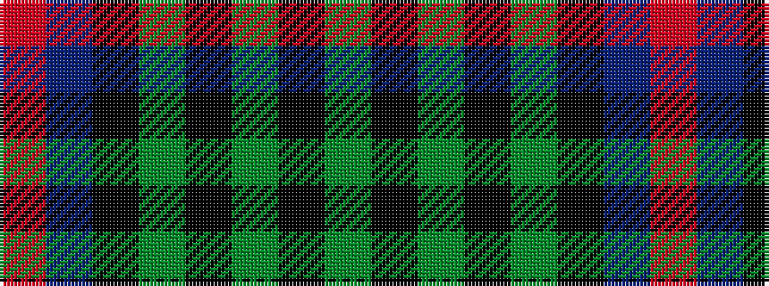

GKGKGKBR

It is a 8 stripe tartan.

<figure class="pat-woven">

<figcaption>idealised sample</figcaption>
</figure>

## Colour Sequence



## Tartans with this colour sequence

| Tartans |
|---------------|
| [Celtic (New) Corporate Sport Tartan Tartan Number: 2232. Earliest known date: 1842 Should have a white line (?). See products available Copyright © Blair Urquhart, Comrie, 2015](/setts/s8/g44k2g2k2g3k12db10r3~x2/)|
||
| [Georgia, State of](/setts/s8/g36k2g2k2g3k12t10r20~x2/)|
||
| [Georgia, State of (District)](/setts/s8/y36k2y2k2y3k12t10r20~x2/)|
||
