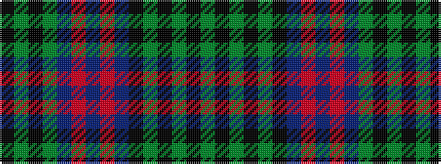

GKGKGKBRBRBGKGK

It is a 15 stripe tartan.

<figure class="pat-woven">

<figcaption>idealised sample</figcaption>
</figure>

## Colour Sequence



## Tartans with this colour sequence

| Tartans |
|---------------|
| [MacLachlan Hunting](/setts/s15/g4k1g1k1g1k5db5r2db2r2db5g5k1g1k1~x6/)|
||
