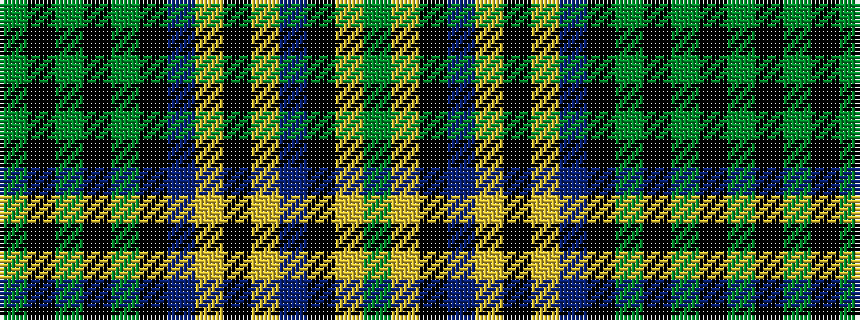

GKGKGKBYKYBKYG

It is a 14 stripe tartan.

<figure class="pat-woven">

<figcaption>idealised sample</figcaption>
</figure>

## Colour Sequence



## Tartans with this colour sequence

| Tartans |
|---------------|
| [Hope-Vere / Weir](/variants/s14/g19k1g4k1g3k10db20ly1k7ly1db20k10ly3g1~x2/)|
||
| [Hope-Vere/Weir #2](/variants/s14/dg19k1dg4k1dg3k10db20ly1k7ly1db20k10ly3dg1~x2/)|
||
