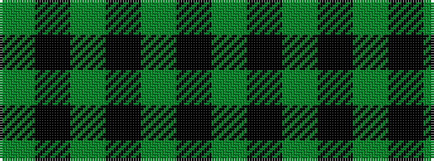

GKGKGKG

It is a 7 stripe tartan.

<figure class="pat-woven">

<figcaption>idealised sample</figcaption>
</figure>

## Colour Sequence



## Tartans with this colour sequence

| Tartans |
|---------------|
| [Scott Black and Grey](/variants/s7/y8k3y17k13y6k3y4~x2/)|
||
