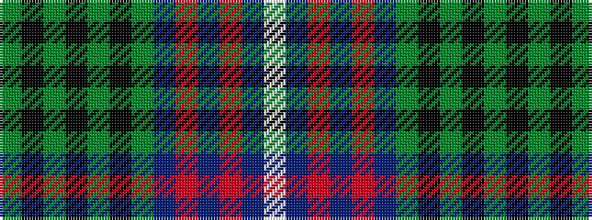

GKGKGKGBRBRBW

It is a 13 stripe tartan.

<figure class="pat-woven">

<figcaption>idealised sample</figcaption>
</figure>

## Colour Sequence



## Tartans with this colour sequence

| Tartans |
|---------------|
| [MacNeil of Colonsay](/setts/s13/g16k5g4k8g44k40g4db52r10db4r4db10w6/)|
||
| [MacNeil of Colonsay (Highland Society of London)](/setts/s13/dg16k5dg4k8dg44k40dg4db52r10db4r4db10w6/)|
||
