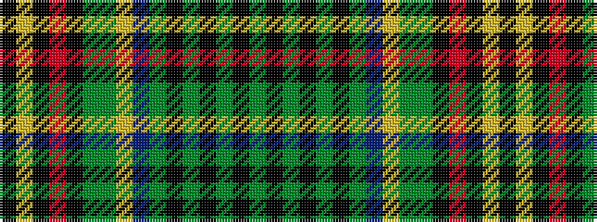

GKGKGKGBYGGKRKYK

It is a 16 stripe tartan.

<figure class="pat-woven">

<figcaption>idealised sample</figcaption>
</figure>

## Colour Sequence



## Tartans with this colour sequence

| Tartans |
|---------------|
| [Belk Heritage Hunting (Fashion)](/variants/s16/k16lo1k4o2k4dy1dg41lo2db1dy36k1dg3k1dy3k1dg4~x2/)|
||
