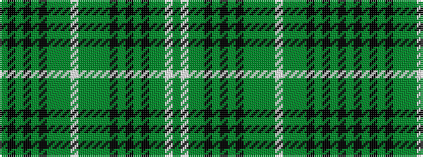

GKGKGKGGGWGGGGKGKGKGGWG

It is a 23 stripe tartan.

<figure class="pat-woven">

<figcaption>idealised sample</figcaption>
</figure>

## Colour Sequence



## Tartans with this colour sequence

| Tartans |
|---------------|
| [Scottish National, dress](/variants/s23/dg11k2dg3k2dg11k8g2g2g2w2g11g2g2g2k8dg11k2dg3k2dg11g12w11g3~x2/)|
||
