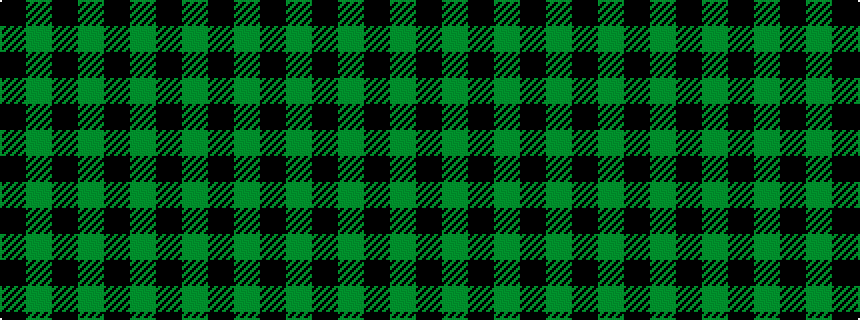

GKGKGKGK

It is a 8 stripe tartan.

<figure class="pat-woven">

<figcaption>idealised sample</figcaption>
</figure>

## Colour Sequence



## Tartans with this colour sequence

| Tartans |
|---------------|
| [Ballindalloch (Estate Check)](/variants/s8/k1dg1~x8/)|
||
| [Douglas VS](/variants/s8/k16y1k1y1k8y16k1y2~x2/)|
||
| [Menzies Green](/variants/s8/k19dg10k6dg10k12dg6k4dg14~x2/)|
||
| [Menzies, Green](/variants/s8/k19g10k6g10k12g6k4g14~x2/)|
||
| [Watertown Library Assoc. (Corporate)](/variants/s8/k4y2k27y2k8y31k2y4~x2/)|
||
