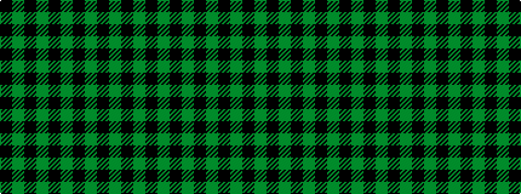

GKGKGKGKGK

It is a 10 stripe tartan.

<figure class="pat-woven">

<figcaption>idealised sample</figcaption>
</figure>

## Colour Sequence



## Tartans with this colour sequence

| Tartans |
|---------------|
| [Guildry of Stirling](/setts/s10/gi18k3gi3k3gi3k21g2k21gi21k4~x2/)|
||
| [Guildry of Stirling](/setts/s10/dg18k3dg3k3dg3k21g2k21dg21k4~x2/)|
||
