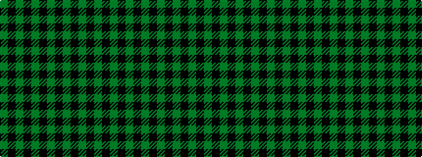

GKGKGKGKGKGKG

It is a 13 stripe tartan.

<figure class="pat-woven">

<figcaption>idealised sample</figcaption>
</figure>

## Colour Sequence



## Tartans with this colour sequence

| Tartans |
|---------------|
| [Brown Watch Trade Tartan](/variants/s13/dy11k1dy1k1dy1k8dg8k1dg8k8dy8k1dy1~x4/)|
||
