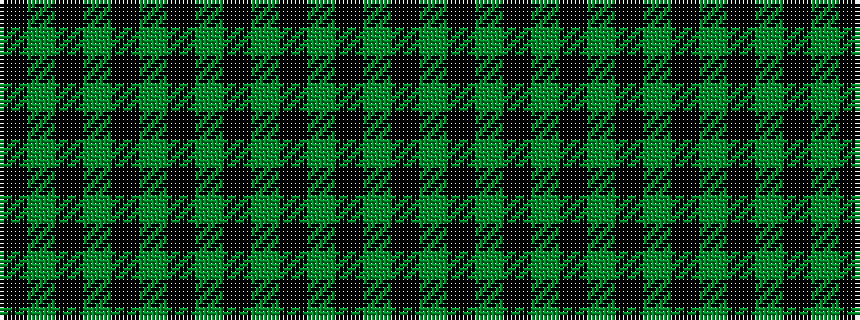

GKGKGKGKGKGKGK

It is a 14 stripe tartan.

<figure class="pat-woven">

<figcaption>idealised sample</figcaption>
</figure>

## Colour Sequence



## Tartans with this colour sequence

| Tartans |
|---------------|
| [Lochcarron Hunting (Corporate)](/setts/s14/dg3k10dg3k2dg2k2dg3k5dg2k5dg22k2dg3k2~x2/)|
||
| [Watertown Library Assoc.](/setts/s14/k4y2k27y2k8y31k2y4~x2/)|
||
