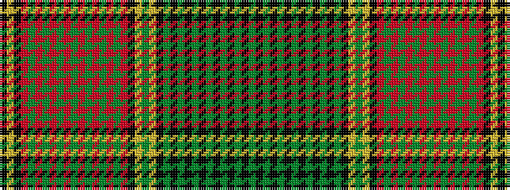

GKGKGKGKGKGKGKYGYKRGRGRGRGRGRGRGRKYK

It is a 36 stripe tartan.

<figure class="pat-woven">

<figcaption>idealised sample</figcaption>
</figure>

## Colour Sequence



## Tartans with this colour sequence

| Tartans |
|---------------|
| [New Brunswick](/setts/s36/g20k1g1k1g1k1g1k1g1k1g1k1g1k8ly8g16ly50k4r6g28r1g1r1g1r1g1r1g1r1g1r1g1r8k24ly12k4/)|
||
| [New Brunswick (PIK Mills, Toronto)](/setts/s36/dg20k1dg1k1dg1k1dg1k1dg1k1dg1k1dg1k8ly8dg16ly50k4r6dg28r1dg1r1dg1r1dg1r1dg1r1dg1r1dg1r8k24ly12k4/)|
||
