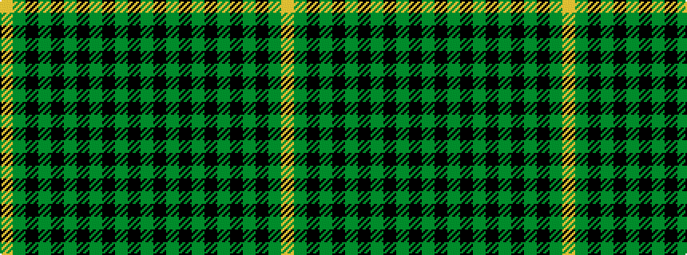

GKGKGKGKGKGY

It is a 12 stripe tartan.

<figure class="pat-woven">

<figcaption>idealised sample</figcaption>
</figure>

## Colour Sequence



## Tartans with this colour sequence

| Tartans |
|---------------|
| [Norwich No.039 (Mackinlay)](/variants/s12/g4k4g4k1g4k4g4k1g4k4g4ly1~x2/)|
||
