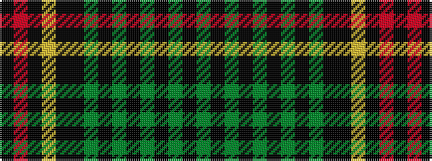

GKGKGKGKGKKYKRK

It is a 15 stripe tartan.

<figure class="pat-woven">

<figcaption>idealised sample</figcaption>
</figure>

## Colour Sequence



## Tartans with this colour sequence

| Tartans |
|---------------|
| [Malcolm (1840)](/setts/s15/k21r4k6lr4k4k21dg21k21dg6k4dg6k4dg6k21dg21/)|
||
